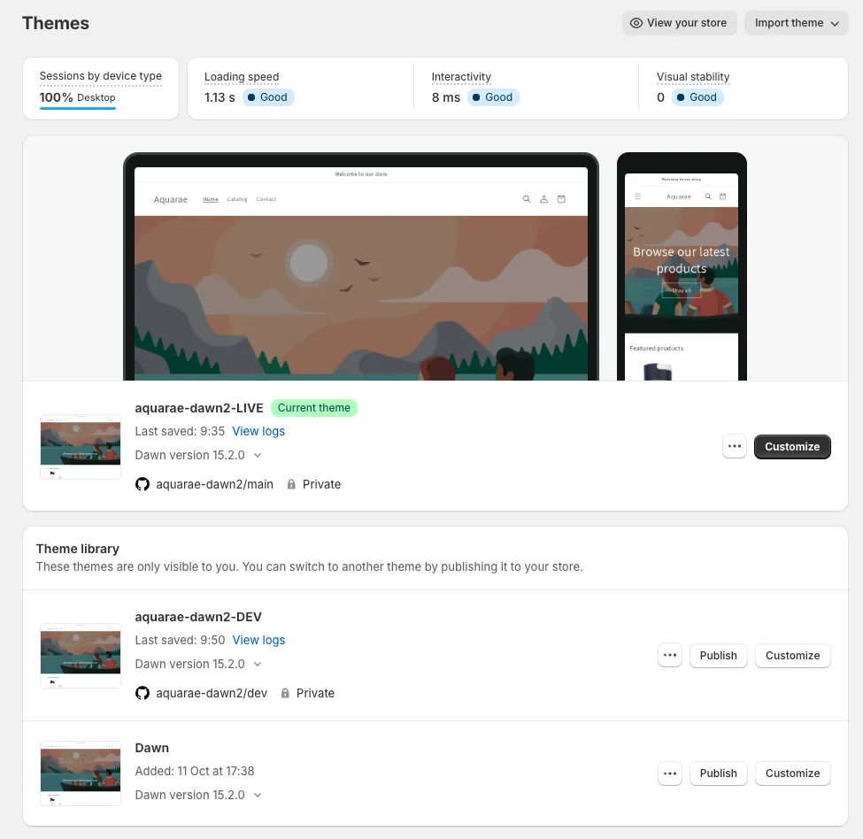
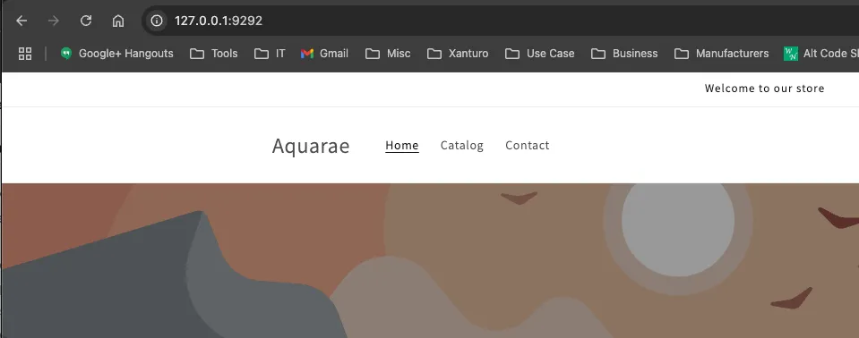

# Aquarae Project Setup

I would suggest working using the CLI and Git as it makes development much more efficient and in addition, the code (theme) is easy to share. Doing this the developer can work locally on his own hardware and sync with the remote repository branch. It can be either my repository or the repository of the contractor. In the first case I will upload the public keys (ssh), in the latter case I can pull from the repository of the contractor, after receiving a notification. In addition it would allow me to first test locally (acceptance test) before deploying to the live website. It also allows feature testing, that I can subsequently try out locally. 

## Workflow Summary
- work and test locally in development or feature branch
- when (integration) testing successful merge upstream  (development, or directly into master)
- verify master locally
- push master

**Notes**
- The CLI theme is a phantom theme, it ceases to exist when the CLI connection is closed, so it’s important to work with GIT in order to preserve changes
- Changes made within the online Shopify theme editor to a DEVELOPMENT theme will NOT be saved into the  corresponding json file (!) SEE: [2]

## Setup and Test  Shopify connection with GitHub

**Reference:**  
[1] https://www.youtube.com/watch?v=72TSwHEhfDs  

### Steps

**Preparation**  
1. Set up a GIT repository on GitHub
2. Install GIT on Mac
3. Set up SSH access to GitHub
4. Clone repo to local
5. Export Dawn theme from Shopify —> alternatively use Shopify CLI to pull theme into current directory, git init, git add  . + commit, create remote repo, connect to remote, push from local
6. Copy files to local repo
7. Stage files
8. Initial commit and push
9. Check remote repo

**Connect and Veriry**  
1. Connect Shopify to Repo
2. Make change in Visual Studio Code to `index.json` (adding !  to Browse our latest Products)
3. Commit and Push
4. Check theme in Preview on Shopify (verify)
5. Make Change to theme on Shopify online (undoing previous change)
6. Check change was automatically received by Git (verify)
7. Pull changes to local
8. Create local branch: dev
9. Create remote branch: dev `> git push --set-upstream origin dev`
10. Rename theme in Shopify to aquarae-dawn2-LIVE
11. Publish aquarae-dawn2-LIVE
12. Connect Shopify to dev branch of git repo

**The dev branch is the working branch, the master is the live branch. See: printscreen**

### Result

## Install Shopify CLI

1. install brew
2. install shopify CLI

> ``brew install node``  
> ``brew postinstall node``  
> ``node —version``  

Response: ``23.1.0``
   
> ``brew install nvm``   
> ``source ~/.zprofile``  
> ``nvm —version``  

Response: 0.40.0

> ``npm install -g @shopify/cli@latest``  
> ``shopify —version``  

Response: ``@shopify/cli/3.69.4 darwin-arm64 node-v23.1.0``  

## Shopify Install for Themes

**References:**  
[2] https://www.youtube.com/watch?v=YM0XOa2LZSs  
[3] https://www.youtube.com/watch?v=wX7q29PY2ps  

> ``shopify theme dev``  

Use the email address you registered with on Shopify.  
      
To run this command, log in to Shopify.  
> User verification code: ____  
> 👉 Press any key to open the login page on your browser  
> Opened link to start the auth process:  
> &emsp;https://accounts.shopify.com/activate-with-code?device_code%5Buser_code%5D=SKQG-MPQS  
> ✔ Logged in.  

### Result

